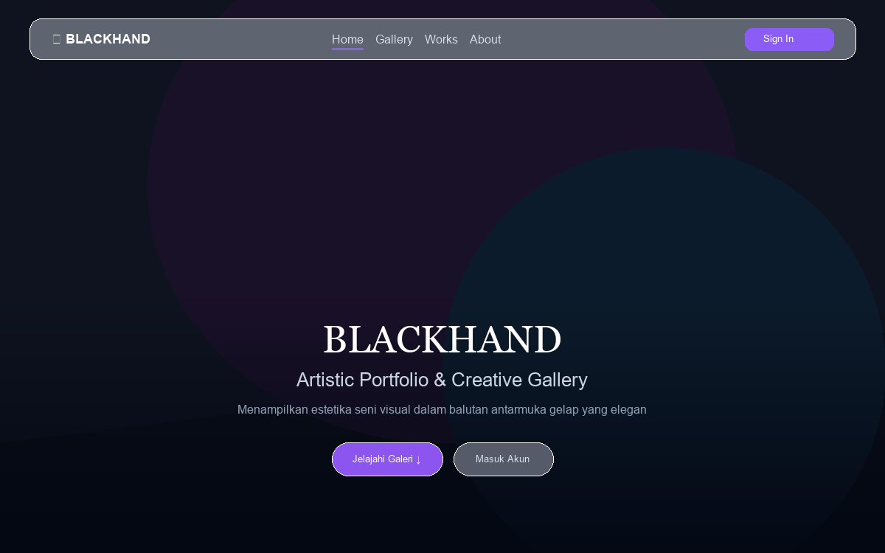
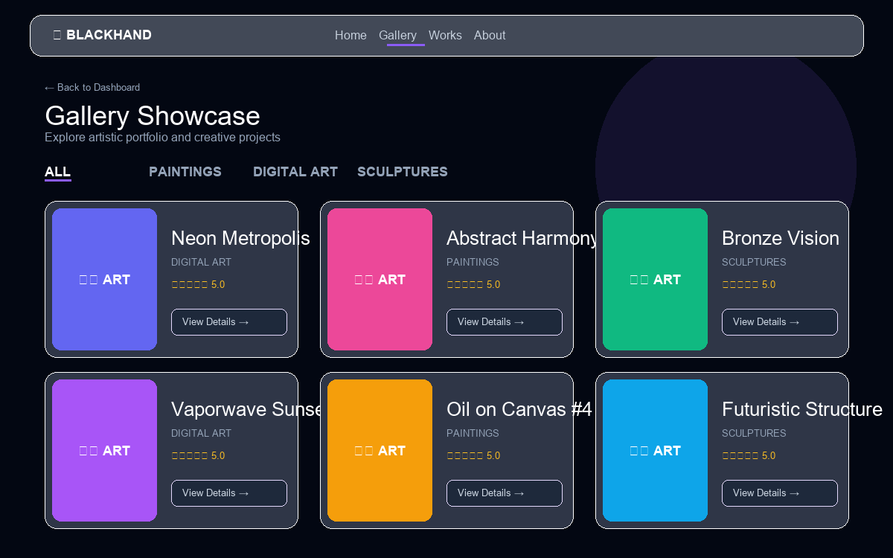
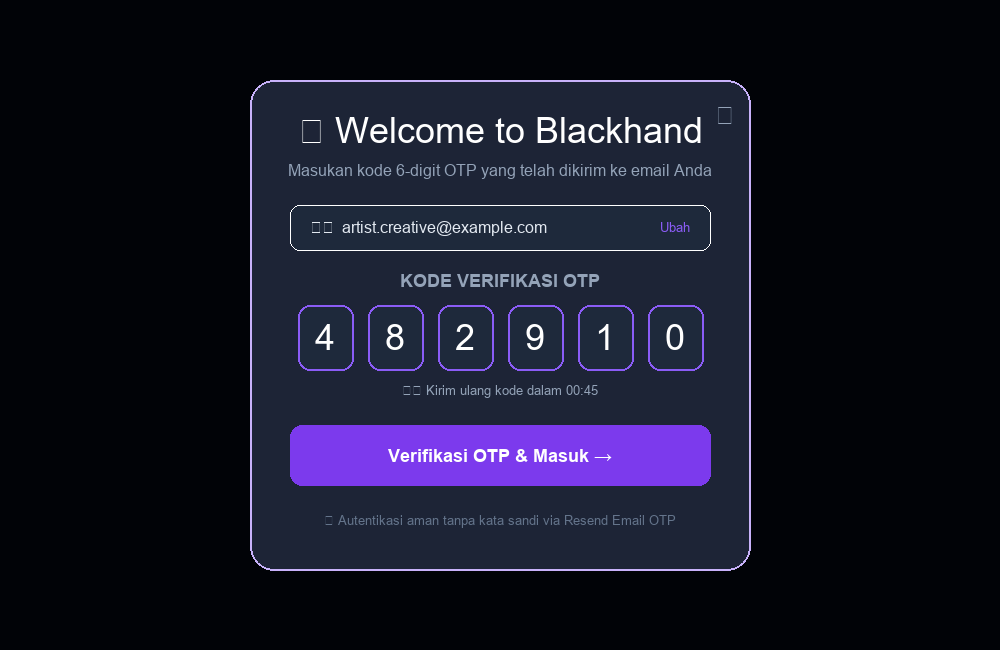

# 🎨 Implementation Plan & Visual Preview - Penyempurnaan UI & UX Blackhand

Dokumen ini berisi **Rencana Implementasi dan Preview Visual Asli (Gambar Tangkapan Antarmuka)** untuk penyempurnaan UI & UX platform **Blackhand** sebelum melanjutkan ke pengoperasian backend.

> [!NOTE]
> **Prinsip Desain Halaman Utama (Landing Page)**: 
> Gambar latar belakang artistik asli (`/arte.jpeg`) **tetap dipertahankan secara penuh (*full-screen background*)** untuk menjaga estetika seni karya asli Blackhand. Penyempurnaan UI/UX berfokus pada sentuhan *dark mode* yang mewah (*vignette overlay*), navigasi melayang *glassmorphic*, dan elemen interaktif yang lebih halus.

---

## 🖼️ Tangkapan Visual Antarmuka (UI Mockup Previews)

Berikut adalah gambaran visual asli desain UI/UX yang disempurnakan untuk platform Blackhand:

```carousel

<!-- slide -->

<!-- slide -->

```

---

## 🔍 Detail Spesifikasi Visual Komponen

### 1. **Landing Page Utama (`/page.tsx`)**


#### 📐 Konsep & Sentuhan Visual:
- **Full-Bleed Background Image (`/arte.jpeg`)**: Latar belakang karya seni asli dipertahankan penuh dengan `object-cover` agar karakter visual aplikasi tetap kuat.
- **Dark Vignette Overlay**: Lapisan gradien halus (`bg-gradient-to-t from-slate-950 via-slate-950/40 to-slate-950/60`) memberikan sentuhan *dark mode* yang dalam dan memastikan tingkat keterbacaan teks yang tinggi.
- **Floating Glassmorphic Navbar**: `bg-slate-900/60 backdrop-blur-xl border border-white/10 rounded-2xl` melayang secara elegan di bagian atas layar.
- **Minimalist Floating CTA**: Tipografi Serif elegan (*BLACKHAND*) di bagian bawah layar disertai tombol aksi melayang bergaya kapsul (*floating glass pill buttons*).

---

### 2. **Halaman Galeri & Filter Portofolio (`/gallery`)**


#### 📐 Fitur Utama Visual:
- **Pill Badge Category Filter**: Filter kategori (*All*, *Paintings*, *Digital Art*, *Sculptures*) dengan garis indikator aktif berwarna violet.
- **Responsive 3-Column Art Grid**: Tata letak grid kartu modern dengan efek *hover zoom* pada gambar.
- **Detail Cards**: Menampilkan nama karya, kategori produk, rating bintang emas, serta tombol interaktif `View Details →`.

---

### 3. **Modal Autentikasi & Verifikasi OTP (`AuthModal.tsx`)**


#### 📐 Fitur Utama Visual:
- **Glassmorphism Modal Dialog**: Dialog melayang di tengah layar dengan sudut melengkung `rounded-3xl` dan border bersinar violet.
- **Interactive OTP 6-Box Pin Input**: Kotak-kotak masukan angka 6-digit OTP yang responsif dengan fokus border aktif saat diketik.
- **Status Countdown Timer**: Hitung mundur kirim ulang OTP yang jelas serta opsi ubah email.

---

## 🛠️ Summary Plan Execution Checklist

- [ ] **Task 1: Global CSS & Dark Styling System** (`app/globals.css`)
  - Utility class untuk dark vignette gradient, ambient violet glow, dan glassmorphism backdrop.
- [ ] **Task 2: Floating Glassmorphism Navbar** (`app/component/Navbar.tsx`)
  - Implementasi header melayang, active link indicator, serta pemindah tema dark/light mode.
- [ ] **Task 3: Artistic Landing Page Enhancement** (`app/page.tsx`)
  - Menggabungkan gambar asli `/arte.jpeg` full-screen dengan sentuhan dark vignette overlay, floating glass pill buttons, dan modal trigger.
- [ ] **Task 4: Auth Modal Visual Refresh** (`app/component/AuthModal.tsx`)
  - Form modal melayang berbasis glassmorphism dengan 6-box OTP pin layout.
- [ ] **Task 5: Gallery & Works Grid Polish** (`app/gallery/page.tsx`, `app/works/page.tsx`)
  - Menyempurnakan filter kategori pill-badge, kartu galeri dengan hover zoom, dan skeleton loading states.
- [ ] **Task 6: Interactive Community Components** (`RatingStars.tsx`, `CommentSection.tsx`, `SupportModal.tsx`)
  - Umpan balik bintang rating bersinar, layout gelembung komentar modern, dan opsi donasi dalam bentuk kartu interaktif.
- [ ] **Task 7: Dashboard & Admin Stats** (`app/dashboard/page.tsx`, `StatsCard.tsx`)
  - Merapikan visualisasi metrik dan kartu statistik dashboard.

---

## 🧪 Plan Verification
- Memastikan landing page mempertahankan gambar `/arte.jpeg` dengan overlay gelap yang mewah.
- Verifikasi visual halaman depan, galeri, modal auth, dan komponen pendukung pada tampilan Desktop & Mobile screen.
